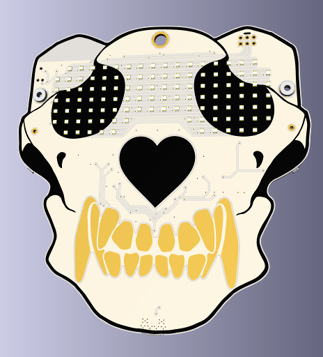

DEFCON Furs Badge Scripts
====================

The 2019 DEFCON Furs badge (made for DC27) is running a Micropython environment that allows
you to script the badge. You can write your own scriptable animations in Python,
or upload them in JSON format.

### Features Include
* STM32L496RET6 microcontroller running Micropython.
* 18x7 pixel RGB matrix display.
* Powered by micro-USB or 2xAA batteries.
* Micro-USB access to the Micropython REPL and filesystem.
* 32 Mbit SPI flash on SPI bus 3.
* Two pushbutton switches located on either side of the badge.
* #4-40 threaded mounting holes for adding faces and bling.
* I2C bus 3 for sensors and expansion.
    - STMicro LIS2DE12 accelerometer at address 0x19.
    - Fanstel BT832A bluetooth module at address 0x42.
    - Compliant with the #badgelife v1.69bis
        [Shitty Addon Standard](https://hackaday.com/2019/03/20/introducing-the-shitty-add-on-v1-69bis-standard/).

### Further Reading
* Source code, schematics and documentation are available on [GitHub](https://github.com/defconfurs/dcfurs-badge-dc27)
* Micropython firmware sources can be found at https://github.com/defconfurs/micropython-dc27
* A web-based tool for creating JSON animations at http://dcfurs.liquidthex.com/2019.php

Badge Module
------------
The `badge` module is implemented in `badge.py` and contains all the setup necessary
to bring your badge to life and operate the peripherals correctly. It is recommended
that you initialize your badge properly by adding an `import badge` statement at the
top of your `main.py` script.

### `badge.imu`
This contains an instance of the LIS2DE12 accelerometer, which has been configured to
perform wakeup and tap detection on the badge. The accelerometer is also available
for orientation detection. Please refer to the micropython documentation for the API
to the `pyb.Accel` class.

### `badge.trysuspend()`
Check if the badge is in a state that can be put to standby mode, when in this state
the LED matrix and CPU will be disabled, and the accelerometer will be configured as
a wakeup source. Upon waking up from standby mode the CPU will perform a hard reset.

The badge will enter standby if all of the following conditions are met:
* No voltage is detected on the VBUS pin (ie: USB disconnected)
* No motion has been detected by the accelerometer in the last `settings.sleeptimeout`
    milliseconds

Settings Module
---------------
The `settings` module is implemented in `settings.py` and contains a collection of
tunable parameters on how you want your badge to operate, such as the default
animation to play on bootup and how long of a timeout to use before going to sleep.

DCFurs Module
-------------
The `dcfurs` module is impleneted within the Micropython firmware, and and includes
the DMA and interrupt handlers necessary to drive the LED matrix. By writing this
module in C, we can acheive a sufficiently fast scan rate to perform approximately
64-steps of dimming control per color.

Pixels in the matrix are addressed by their column and row coordinates, starting from
row zero and column zero in the upper left corner of the matrix.

### `dcfurs.init(timer)`
Initialize the LED matrix and DMA interrupt handlers, this must be called anything can
be written to the LED matrix. The `timer` parameter provides a handle to the STM32
Advanced-function timer `TIM8`, configured at the desired PWM frequency. This timer
will be used to schedule interrupts and DMA transfers in to refresh the delay. A PWM
frequency of at least 250kHz is recommended.

```
    import dcfurs
    from pyb import Timer

    pwmclk = pyb.Timer(1, freq=500000)
    dcfurs.init(pwmclk)
```

### `dcfurs.clear()`
Clear the LED matrix, setting all pixels to an off state.

### `dcfurs.set_pixel(col, row, value=True)`
Sets the color of a single pixel using its column and row coordinates in the matrix.
The `value` parameter can provide the pixel's color using 8-bit color. If `value` is
an integer, it encodes 3-bits of red, 3-bits of green and 2-bits of blue into a single
byte. Otherwise the truth value will either set the pixel to white at full intensity,
or switch it off.

### `dcfurs.set_pix_rgb(col, row, value)`
Sets the color of a single pixel using its column and row coordinates in the matrix.
The `value` parameter must be an integer which encodes a 24-bit color to use for the
pixel, with 8-bits of red, 8-bits of green and 8-bits of blue (eg: `0xRRGGBB`).

### `dcfurs.set_pix_hue(col, row, hue, val=255)`
Sets the color of a single pixel using its column and row coordinates in the matrix.
The color is specified in HSV color space, with `hue` being an angle between 0 and
360 degrees. The `val` parameter is optional and specifies the intensity value in the
range of 0-255. The saturation component of the HSV color space is assumed to be 1.0
for full saturation.

### `dcfurs.set_row(row, pixels, color=0xffffff)`
Set the pixels for an entire row using a bitmap of pixel on/off values. The `pixels` 
parameter can contain an integer, which will act as a bitmask of the pixels for this
row, or an `bytearray` of PWM intensities. The third argument, `color` is optional
and may specify the 24-bit color to use for the row.

### `dcfurs.set_frame(fbuf)`
Sets the entire frame buffer in a single call. The `fbuf` parameter should be an array exactly
`dcfurs.nrows` in length, each elemnent of which describes one row of the matrix. If the row
is an integer, it is interpreted as a bitmap that would be passed to `dcfurs.set_row()`, or if
the row is a `bytearray` then it will be interpreted as an array of PWM intensity values.

This function can be implemented as a slightly more efficient version of:

```
    def set_frame(fbuf)
        i = 0
        for row in fbuf:
            set_row(i, row)
            i += 1
```

### `dcfurs.has_pixel(col, row)`
Checks if the pixel at the given column and row exists in the LED matrix. Due to the shape
of the badge, some of the pixels at the corners of the matrix and over the bridge of the
nose are missing from the display. This function will return `True` if the pixel exists
and `False` otherwise.

### `dcfurs.nrows`
This constant integer defines the number of rows in the LED matrix. This will have a
value of 7.

### `dcfurs.ncols`
This constant integer defines the number of columns in the LED matrix. This is will
have a value of 18.

### `dcfurs.boop`
This class accesses the capacative touch controller built into the STM32L4 microcontroller.

Badge Animations
================
Badge animations can be written as Python classes, or can be provided as JSON frame
data. The resulting animations will be included as part of the `animations` module,
with each class in this module providing a unique animation.

Every class provided by this module must present the following interface.

### `draw()`
This mandatory method is called to render the next frame of the animation to the
LED matrix.

### `interval`
This mandatory variable must be provided by the animation to define the time, in
milliseconds until the next call to the `draw()` method.

### `boop()`
The animation may override the default behavior of the capacative touch events by
defining a `boop()` method. This optional method will be called once for each touch
event detected.

Python Animations
-----------------
Badge animations written in python should be placed in the `animations/` directory, and
must implement both the `draw()` method and set the `interval` variable. We can write a
simple row-scanning example as follows:

```
    import dcfurs

    class example:
        def __init__(self):
            self.counter = 0
            self.interval = 500
        
        def draw(self):
            self.counter += 1
            dcfurs.clear()
            dcfurs.set_row(self.counter % dcfurs.nrows, 0x3ffff)
```

From a REPL console, you can now run your animation with a simple python loop.

```
    import animations

    test = animations.example()
    while True:
        test.draw()
        pyb.delay(test.interval)
```

JSON Animations
---------------
For simple animations that don't require user interraction, the frames can also be
provided in JSON format. These animations should be placed in the `animations/`
directory and named with a `.json` file extension. During initialization the
`animations` module will generate class definitions for each JSON file found.

The JSON file should contain an array, with each element of the array containing
a JSON object that defines the frame, and the duration for which that frame should
be displayed. The animation will run indefinetely looping over each frame in the
array. Each frame object must contain an `interval` member encoded as an integer
number of milliseconds and at least one valid encoding of frame data.

Frame data is always encoded as a hexadecimal string, with the colon character
used to delimit rows of the display. The name of the object member is used to
distinguish between the supported pixel encodings.

Frame objects which encode monochrome pixels shall include a `frame` member that
contains a hexadecimal string representation of the frame. Each nibble of the
string sets the brighness for a single pixel with a value of `0` turning the pixel
off and `F` setting the pixel to full intensity.

Frame objects which encode color shall include an `rgb` member that contains a
hexadecimal string representation of the frame. Each pair of nibbles of the string
sets the color for a single pixel in 8-bit color.

Frame objects may also use a palette color scheme by including a `palette` member,
in which case a single nibble encodes each pixel using the 16 xterm system colors.

Thus a single frame which shows PWM intensity increasing from right to left and top to
bottom can be encoded as:

```
    [
        {
            "interval": 1000,
            "frame": "000000000000001234:000000000000123456:000000000012345678:00000000123456789a:000000123456789abc:0000123456789abcde:00123456789abcdeff"
        }
    ]
```

Or, a palette-encoded frame which shows a rainbow of RGBCMY from top to bottom
can be encoded as:

```
    [
        {
            "interval": 1000,
            "palette": "999999999999999999:aaaaaaaaaaaaaaaaaa:cccccccccccccccccc:eeeeeeeeeeeeeeeeee:dddddddddddddddddd:bbbbbbbbbbbbbbbbbb:000000000000000000"
        }
    ]
```

Recovery and Programming Modes
==============================
If something has gone wrong with your badge, don't panic! There are many
ways to recover the state of your firwmare.

During power on, the two pushbuttons switches on either side of the badge
can be used to select the boot mode of the badge firmware. Switch `SW1` is
located adjacent to the power switch and puts the badge into DFU bootloader
mode. Switch `SW2` is located on the opposite side, below the bluetooth
module, and puts the badge into safe mode or performs factory recovery.

Safe Mode and Recovery
----------------------
If switch `SW2` is pressed during power on, the LED on the back of the badge
will begin to cycle through three colors: Green, Blue and Cyan to select
the boot mode. To select a boot mode, wait until the desired color is active
and then release `SW2`. The badge will flash your selected mode and then proceed
to boot.

| LED Color | Mode          | Description
|-----------|---------------|-------------------
| Green     | Normal        | Mounts the filesystem, then execute `boot.py` and `main.py`.
| Blue      | Safe Mode     | Mounts the filesystem, and stops at a REPL prompt for user input.
| Cyan      | Recovery Mode | Format and restore the filesystem, then execute `boot.py` and `main.py`.

Updating Firmware
-----------------
The STM32L496 microcontroller features a USB DFU bootloader, which is capable
of updating the badge firmware from a PC over USB. To perform this upgrade, you
will need the `firmware.dfu` image, as well as DFU programming software such as
the [dfu-util](http://dfu-util.sourceforge.net/) program for Linux or OSX, or
[DfuSe](https://www.st.com/en/development-tools/stsw-stm32080.html) for Windows.

### Linux and Mac OSX
1. Completely power down the badge by removing the batteries and USB power.
2. Power on badge via USB while holding down switch `SW1`, located adjacent
    to the power swtich. The badge should enumerate with the PC as an
    `STMicroelectronics STM Device in DFU Mode`
3. Execute the command `dfu-util -a 0 -d 0483:df11 -D firmware.dfu`. Note that
    this may require `sudo` depending on your operating system and USB permissions.
4. Wait for the upgrade to complete, which may take up to 30 seconds.
5. Unplug the badge from USB and restart the badge to boot into the new firmware.

### Windows
1. Completely power down the badge by removing the batteries and USB power.
2. Power on badge via USB while holding down switch `SW1`, located adjacent
    to the power swtich.
3. Run the `DfuSe demonstration` application from STMicroelectronics.
4. Click the `Choose` button to select a DFU file.
5. Check the `Optimize upgrade duration` checkbox to ignore FF blocks during the upload.
6. Check the `Verify after download` checkbox if you want to launch the verification process
    after downloading the firmware image to the badge.
7. Click the `Upgrade` button to start upgrading file content to the memory.
8. Click the `Verify` button to verify if the data was successfully downloaded.
9. Unplug the badge from USB and restart the badge to boot into the new firmware.
