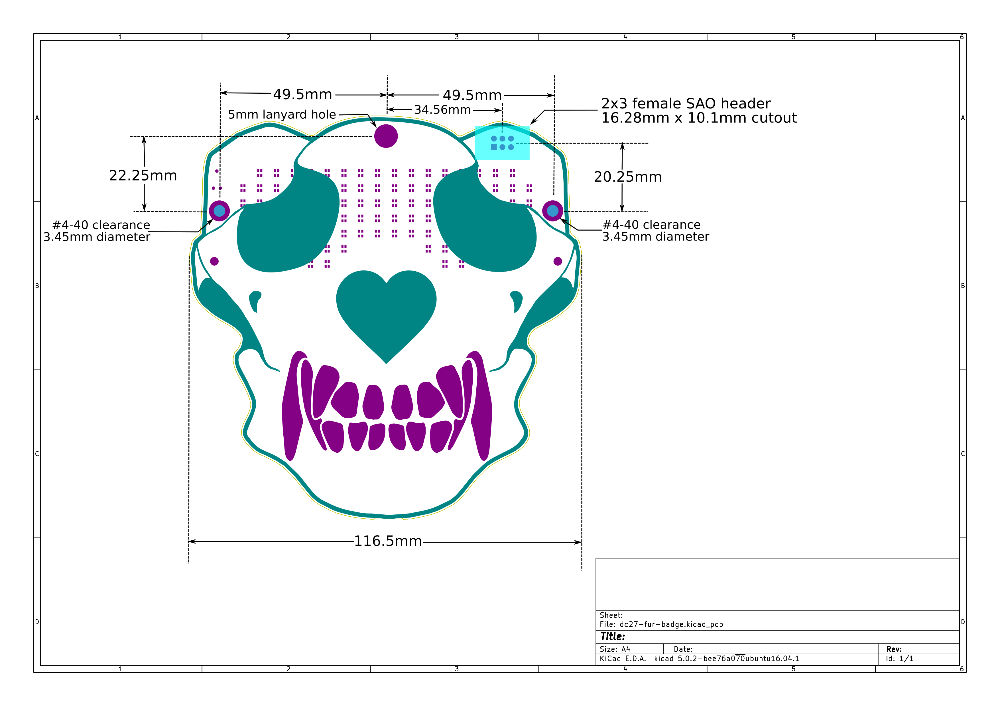
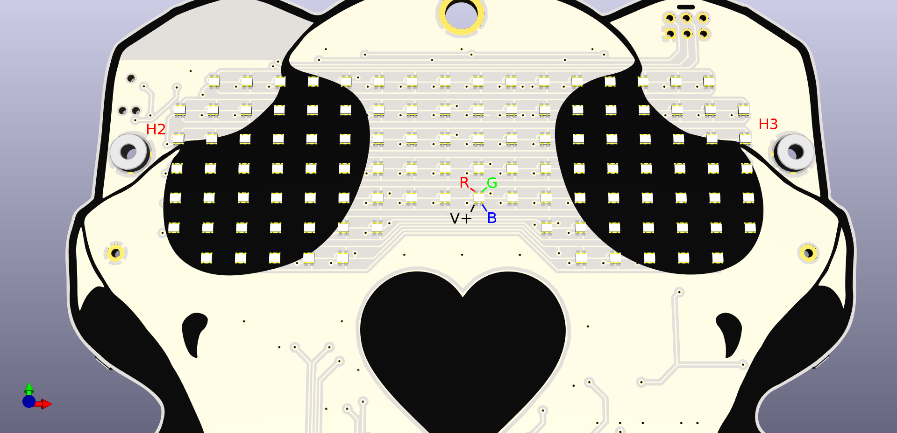
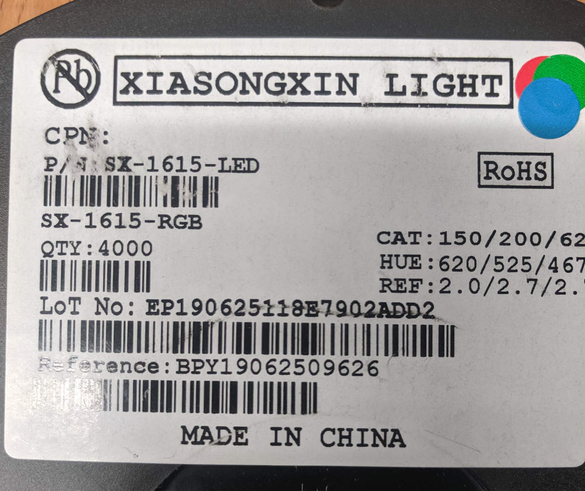
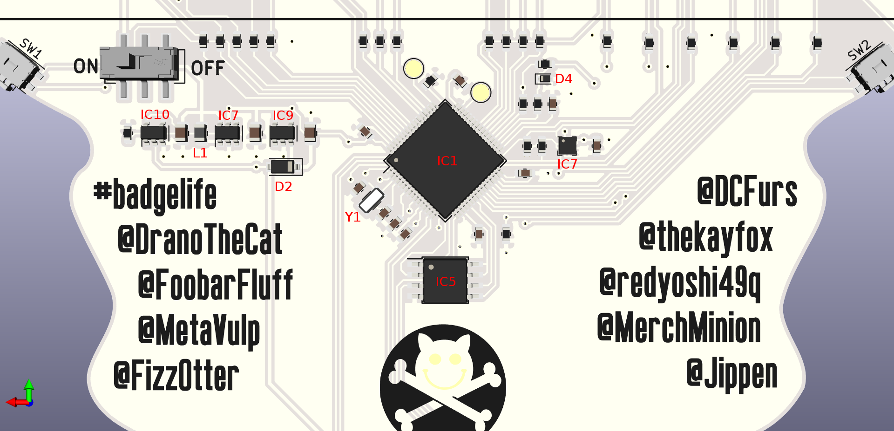
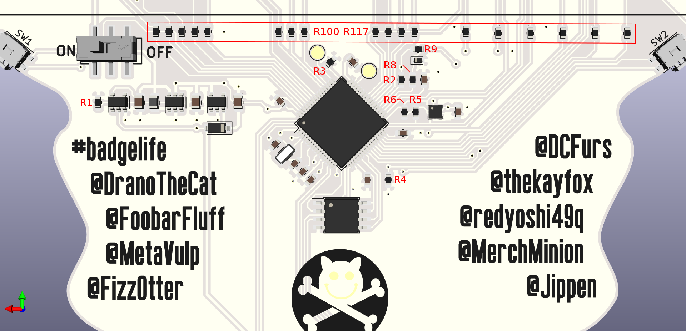
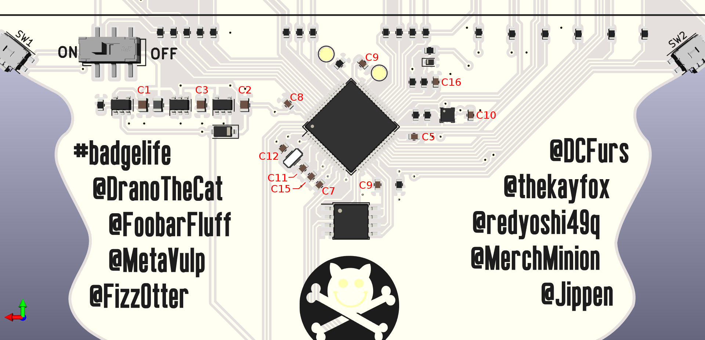
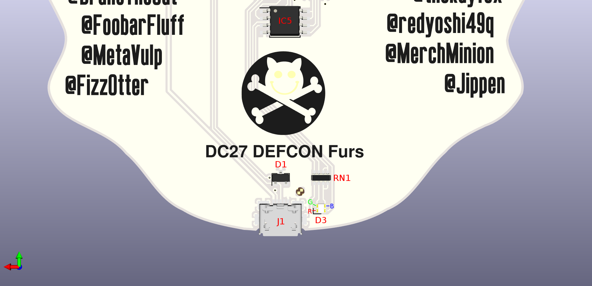
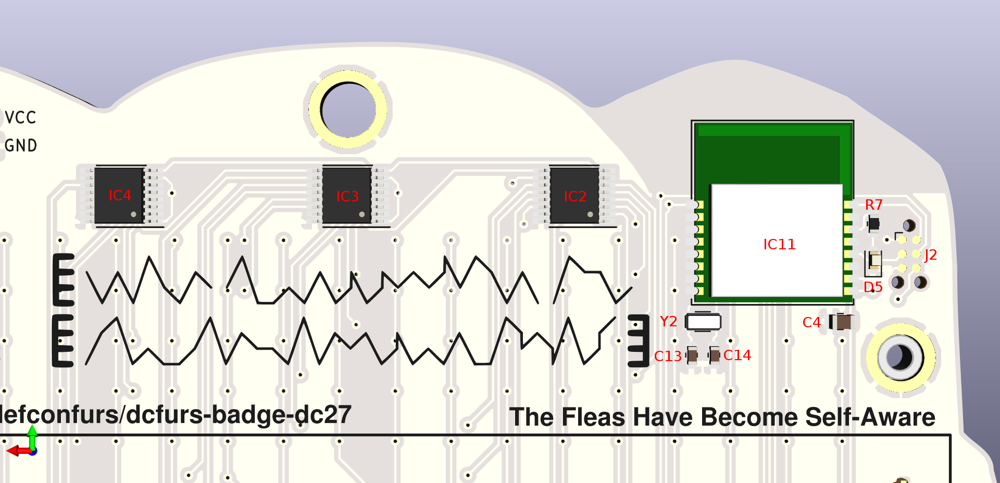

DCFurs Badge Assembly Guide
===========================
In this guide you should find all the information you need to assemble a DCFurs
blank PCB into fully functional badge:

 * Electrical schematic in [PDF](schematic.pdf) format.
 * Mechanical Diagram in both [PNG](badge-mechanical.png) and [SVG](badge-mechanical.svg) formats.
 * Stencil gerbers for the [top](stencil-paste-top.gtp) and [bottom](stencil-paste-bottom.gbp) layers.
 * [Bill of Materials](#bill-of-materials)
 * Assembly Diagrams for the [front](#front-assembly) and [back](#back-assembly) sides of the badge.

Bill of Materials
-----------------
The list of components, quantities, and our recommended distributors are as follows

| Designator | Quantity | Manufacturer  | Part | Description
|------------|----------|---------------|------|------------
| J1         | 1        | Amphenol      | [10118192-0001LF](https://www.mouser.com/ProductDetail/649-10118192-0001LF) | USB micro-B connector
| J2         | DNP      | Tag Connect   | [TC2030-CTX-NL](http://www.tag-connect.com/TC2030-IDC-NL) | JTAG debug cable [1](#footnote1)
| J3         | 1        |               |      | Shitty Add-On Header
| IC1        | 1        | STMicro       | [STM32L496RET6](https://www.mouser.com/ProductDetail/511-STM32L496RET6) | Microprocessor
| IC2-IC4    | 3        | Nexperia      | [NPIC6C596APWJ](https://www.mouser.com/ProductDetail/771-NPIC6C596APWJ) | LED row drivers
| IC5        | 1        | Winbond       | [W25Q32JVSSIM](https://www.mouser.com/ProductDetail/454-W25Q32JVSSIMTR) | Micropython flash storage
| IC7        | 1        | STMicro       | [LIS2DE12TR](https://www.mouser.com/ProductDetail/511-LIS2DE12TR) | Accelerometer
| IC8        | 1        | Skyworks      | [AAT1217ICA-3.3-T1](https://www.mouser.com/ProductDetail/873-AAT1217ICA3.3T1) | DC-DC boost converter
| IC9        | 1        | Microchip     | [MIC5504-3.3YM5-TR](https://www.mouser.com/ProductDetail/998-MIC5504-3.3YM5TR) | USB linear regulator
| IC10       | 1        | ON Semi       | [MC74VHC1G04DTT1G](https://www.mouser.com/ProductDetail/863-MC74VHC1G04DTT1G) | Power selection logic
| IC11       | 1        | Fanstel       | [BT832A](https://www.mouser.com/ProductDetail/308-BT832A) | Bluetooth module [1](#footnote1)
| H2, H3     | 2        | Keystone      | [4881](https://www.mouser.com/ProductDetail/534-4881) | #4-40 threaded insert
| BT1        | 1        | MPD           | [BC12AAPC](https://www.digikey.com/product-detail/en/BC12AAPC/BC12AAPC-ND/2439230) | 2xAA Battery holder
| R1, R3-R6  | 5        | KOA Speer     | [RK73H1JTTD2201F](https://www.mouser.com/ProductDetail/660-RK73H1JTTD2201F) | 2.2k-ohm pullup resistors
| R2, R8     | 2        | KOA Speer     | [RK73H1JTTD1001F](https://www.mouser.com/ProductDetail/660-RK73H1JTTD1001F) | 1k-ohm resistors for capacative touch
| R7         | 1        | KOA Speer     | [RK73H1JTTD1800F](https://www.mouser.com/ProductDetail/660-RK73H1JTTD1800F) | 180-ohm resistor for the bluetooth LED [1](#footnote1)
| R100-R117  | 18       | KOA Speer     | [RK73H1JTTD33R0F](https://www.mouser.com/ProductDetail/660-RK73H1JTTD33R0F) | 33-ohm resistors for the LED matrix
| RN1        | 1        | Bourns        | [CAT16-331J4LF](https://www.mouser.com/ProductDetail/652-CAT16-331J4LF) | 330-ohm resistor array for the status LED
| D1         | 1        | Diodes Inc.   | [DT1452-02SO-7](https://www.mouser.com/ProductDetail/621-DT1452-02SO-7) | USB reverse power protection diode
| D2         | 1        | SMC Diodes    | [DSS15UTR](https://www.digikey.com/product-detail/en/DSS15UTR/1655-1928-1-ND/8341870) | USB ESD protection diode
| D3         | 1        | Lite-On       | [LTST-C19HE1WT](https://www.mouser.com/ProductDetail/859-LTST-C19HE1WT) | RGB status LED
| D4         | 1        | ON Semi       | [ESD7371XV2T1G](https://www.mouser.com/ProductDetail/863-ESD7371XV2T1G) | ESD diode for capacative touch
| D5         | 1        | Lite-On       | [LTST-C193TBKT-5A](https://www.mouser.com/ProductDetail/859-LTSTC193TBKT5A) | Bluetooth status LED [1](#footnote1)
| D101-D716  | 112      | Lite-On       | [LTST-C19HE1WT](https://www.mouser.com/ProductDetail/859-LTST-C19HE1WT) | RGB Matrix LEDs [2](#footnote2)
| L1         | 1        | Taiyo Yuden   | [MAKK2016T2R2M](https://www.mouser.com/ProductDetail/963-MAKK2016T2R2M) | 2.2uH inductor for the DC-DC boost converter
| SW1, SW2   | 2        | Wurth         | [434331045822](https://www.digikey.com/product-detail/en/434331045822/732-7055-1-ND/5225503) | User switches
| SW3        | 1        | C&K           | [JS202011SCQN](https://www.mouser.com/ProductDetail/611-JS202011SCQN) | On/Off power switch
| C1-C4      | 4        | Samsung       | [CL21A475KPFNNNG](https://www.digikey.com/product-detail/en/CL21A475KPFNNNG/1276-6464-2-ND/3894442) | 4.7uF bulk capacitors
| C5-C10     | 6        | Samsung       | [CL10B104KB8NNNC](https://www.digikey.com/product-detail/en/CL10B104KB8NNNC/1276-1000-2-ND/3886658) | 0.1uF decoupling capacitors
| C11-C15    | 5        | Samsung       | [CL10C150JB8NNNC](https://www.digikey.com/product-detail/en/CL10C150JB8NNNC/1276-1296-2-ND/3886954) | 15pF crystal capacitors
| C16        | 1        | Samsung       | [CL10B103KB8SFNC](https://www.digikey.com/product-detail/en/CL10B103KB8SFNC/1276-1924-1-ND/3890010) | 10nF capacative touch sampling capacitor
| Y1, Y2     | 2        | Epson         | [FC-135 32.7680KA-A3](https://www.mouser.com/ProductDetail/732-FC135-32.76KAA3) | 32.768kHz crystal
| Screws     | 2        | Keystone      | [9900](https://www.digikey.com/product-detail/en/9900/36-9900-ND) | #4-40 face mounting screws
| EMI Tape   | 1        | Laird         | [4357PA51H01800](https://www.mouser.com/ProductDetail/739-4357PA51H01800) | Capacative touch pads for faceplate

<a name="footnote1">1</a>: We recommend omitting the bluetooth module if you lack the ability to program it via JTAG.

<a name="footnote2">2</a>: Prototype and production badges have used a variety of matrix LEDs. See the [Front Assembly Guide](#front-assembly) for more details.

Front Assembly
--------------
The RGB LEDs on the from of the bage, parts D101 through D716, are all oriented in
the same direction. When viewed from the front of the badge the red cathode is in
the northwest corner of the LED, the green cathod is in the northeast corner of the
LED, the blue cathode is in the southeast corner of the LED and the common anode is
in the souwthwest corner of the LED. Most RGB LEDs will also include a mark in one
corner to aid in identifying which pin is the common anode, but I recommend double
checking the pinout using a multimeter in diode test mode.

As a further note on the selection of LEDs, the prototype boards were designed with
the Lite-On LTST-C19HE1WT for the RGB LED matrix, however, for the production badges
an Aliexpress vendor was found for the LEDs ([link](https://www.aliexpress.com/item/32336475934.html)).
Replacing a production LED with the Lite-On part number may result in noticeable color
mismatch between the LEDs being used.

|                  | Lite-On LTST-C19HE1WT  | Xiasongxin SX-1615-RGB    |  
|------------------|------------------------|---------------------------|
| Red Voltage      | 2.1V                   | 2.0V                      |
| Red Wavelength   | 624nm                  | 620nm                     |
| Green Voltage    | 3.35V                  | 2.7V                      |
| Green Wavelength | 525nm                  | 525nm                     |
| Blue Voltage     | 3.35V                  | 2.7V                      |
| Blue Wavelength  | 470nm                  | 467nm                     |
| Test Current     | 20mA                   | 20mA                      |

Back Assembly
-------------
### Back Placement Details

### Resistor Placement Details

### Capacitor Placement Details

### USB Placement Details

### Bluetooth Placement Details
Before placing the bluetooth module, you should consider whether you have the tools
available to program the BLE module. The OEM firmware that comes on the bluetooth
modules will assert a voltage on to the I2C bus, rendering the accelerometer and the
SAO header unusable.

If you do not have the capability to program the bluetooth module, we recommend
omitting parts IC11, Y2, C4, C13, C14, D5 and R7. With these parts missing, the badge
will function as normal, but will neither react to, nor transmit bluetooth beacons.

Test Procedure
--------------
 0. Set the power switch to the `OFF` position.
 1. Attach badge to a PC using the USB port while holding SW1.
    * Badge should enumerate as an `STMicroelectronics STM Device in DFU Mode`
    * Badge should enumerate with device identifier 0483:df11
 2. Program the provided firmware-l496.dfu file using dfu-util as follows:
    * `sudo dfu-util -a0 -d 0483:df11 -D firmware-l496.dfu`
    * Flashing should take about 60 seconds.
 3. Disconnect the badge from the PC to power down completely.
 4. Connect badge to a PC using the USB port while holding SW2.
    * RGB LED next to the USB connector will cycle between Green, Blue and Cyan
 5. Release SW2 when the RGB LED is cyan.
    * This begins the filesyetem reformating and factory recovery procedure.
    * LED will flicker between cyan and while while formatting.
    * When complete LED will pulse red while booting micropython.
 6. Wait for the badge to finish booting micropython. This should take at most 30 seconds.
    * Once complete, the default aniation will play.
    * Scrolling text on the  front of the badge should read `DEFCON Furs` in rainbow colors.
 7. Press SW1 once to switch the animation to a diagonal rainbow waterfall pattern.
    * No dead LEDs or aberrent colors should be seen.
 8. Press SW2 twice more to switch to the accelerometer-driven worm animation.
 9. While holding the vertical with the laynard hole at the top, tilt the badge from side to side.
    * At a tilt of about 45 degrees, the pixels should appear to flow downwards.
 10. Tap the black silkscreen nose with your finger for about 1s.
     * Animation should change to text reading `BooP`
 11. Install batteries and switch the power switch to the `OFF` position.
     * No distruption to the animation should occur.
 12. Measure pin 4 of IC8 (the SOT-23-6 package adjacent to inductor L1).
     * Pin 4 (SHDN) should have a voltage of approximately 0V.
 13. Switch the power switch to the `ON` position and measure pin 4 of IC8 again.
     * No distruption to the animation should occur.
     * Pin 4 (SHDN) should have a voltage of approximately 0V.
 14. Disoconnect the badge from USB power.
     * No distruption to the animation should occur.
     * Pin 4 (SHDN) should have a voltage of approximately 3V depending on battery charge.
 15. Switch the power switch to the `OFF` position.
     * The badge should shut off.